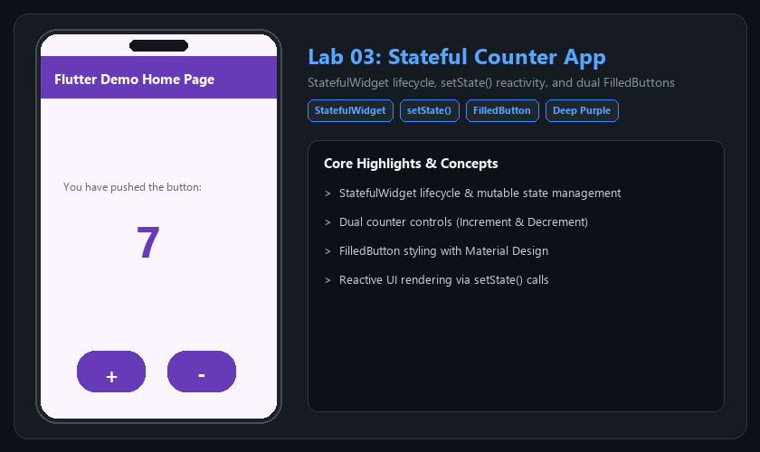

# 📱 Lab 03: Stateful Counter App

> การจัดการสถานะ (State Management) ของแอปด้วย StatefulWidget และการเปลี่ยนแปลงค่าตัวเลขผ่านการเรียก setState() ร่วมกับปุ่ม FilledButton



---

### 🌟 ฟีเจอร์หลัก (Key Features)
- StatefulWidget vs StatelessWidget
- setState() reactivity
- Dual FilledButtons (+ and -)

---

### 🚀 วิธีการทดสอบและรัน (How to Run)
```bash
flutter pub get
flutter run
```

---
[⬅️ กลับสู่หน้าหลัก Portfolio](../README.md)
