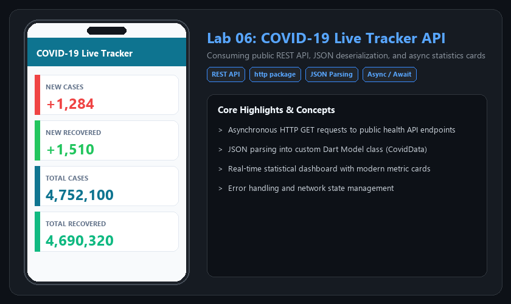

# Lab 06: COVID-19 Live Tracker API

> แอปพลิเคชันดึงข้อมูลสถิติผู้ติดเชื้อ COVID-19 ผ่าน REST API สาธารณะ โดยใช้แพ็กเกจ http และแปลง JSON เป็น Object เพื่อแสดงผลในการ์ดสถิติ



---

### ฟีเจอร์หลัก (Key Features)
- HTTP GET Request with async / await
- JSON parsing into CovidData Model
- Dynamic metric status cards

---

### วิธีการทดสอบและรัน (How to Run)
```bash
flutter pub get
flutter run
```

---
[กลับสู่หน้าหลัก Portfolio](../README.md)
