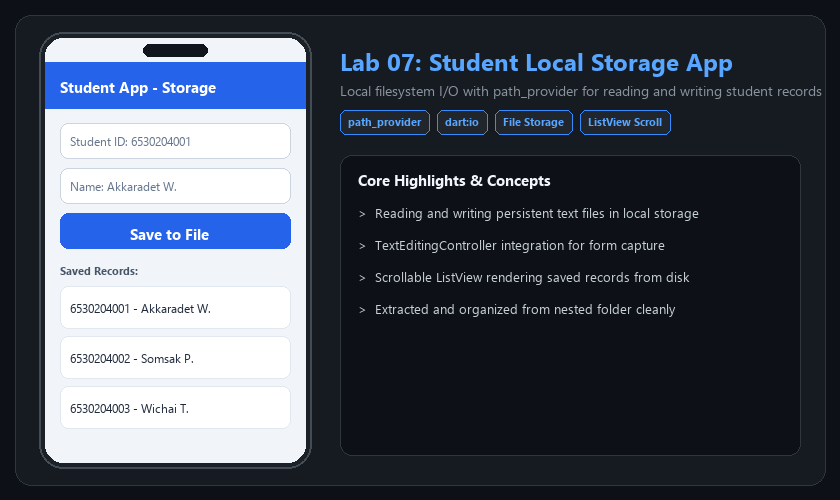

# 📱 Lab 07: Student Record Local Storage

> ระบบจัดเก็บข้อมูลประวัตินักศึกษาลงใน Local Storage ของอุปกรณ์ด้วย path_provider และ dart:io สามารถบันทึกและดึงข้อมูลมาแสดงใน ListView ได้อย่างต่อเนื่อง



---

### 🌟 ฟีเจอร์หลัก (Key Features)
- Local file reading and writing via path_provider
- Form input with TextEditingController
- Scrollable ListView history

---

### 🚀 วิธีการทดสอบและรัน (How to Run)
```bash
flutter pub get
flutter run
```

---
[⬅️ กลับสู่หน้าหลัก Portfolio](../README.md)
