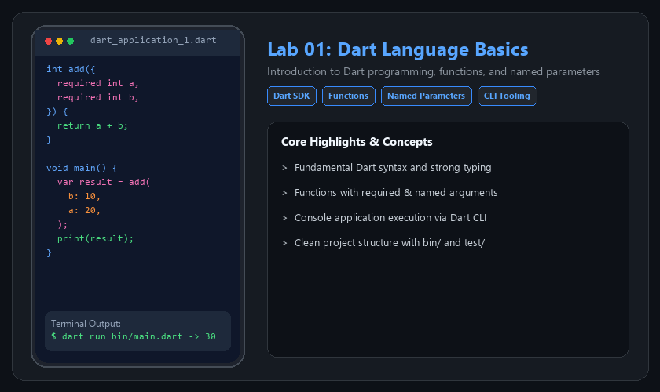
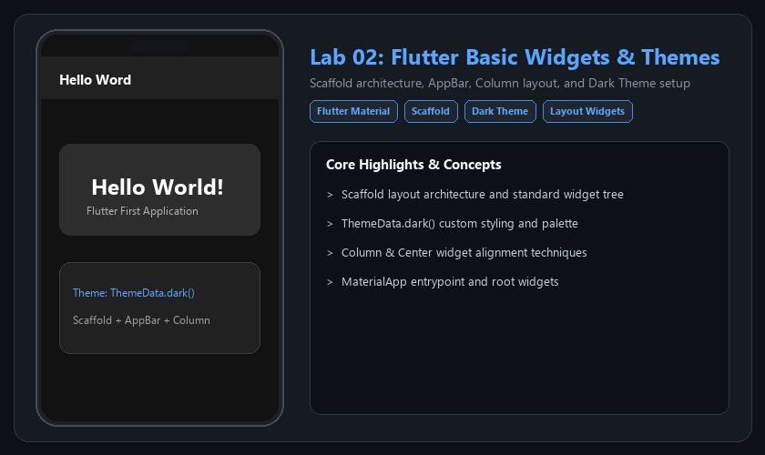
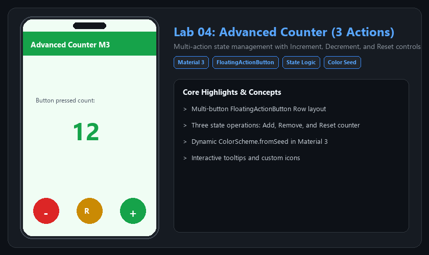
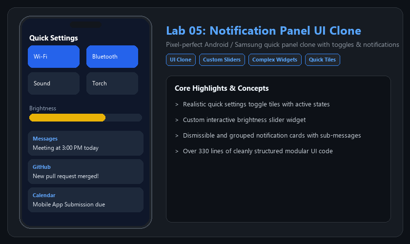
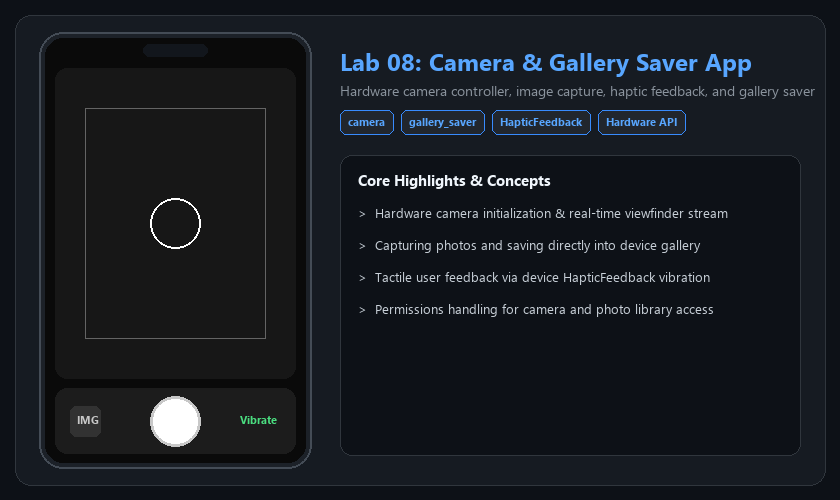
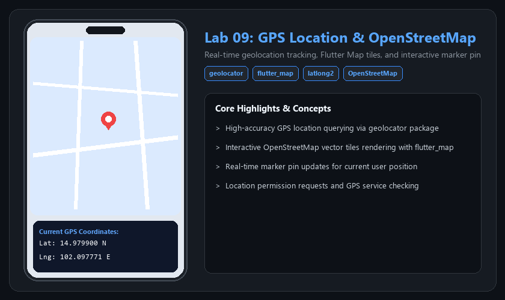

# 📱 Mobile Application Development Portfolio
### รายวิชาการพัฒนาแอปพลิเคชันบนอุปกรณ์เคลื่อนที่ (Flutter & Dart)

<p align="left">
  <a href="https://github.com/Akkaradet-Wong"></a>
  <a href="mailto:pa0653407100@gmail.com"></a>
  
  
</p>

---

## 👨‍💻 ผู้จัดทำ (Developer Profile)
- **ชื่อ-นามสกุล:** นายอัครเดช วงษ์บำหราบ (Akkaradet Wongbamrap)
- **GitHub:** [@Akkaradet-Wong](https://github.com/Akkaradet-Wong)
- **วิชา:** Mobile Application Development (การพัฒนาแอปพลิเคชันบนอุปกรณ์เคลื่อนที่)
- **แพลตฟอร์มที่พัฒนา:** Flutter (Cross-platform Android / iOS / Web)

---

## 📑 สารบัญผลงานประจำแต่ละ Lab (Quick Jump)

| Lab | หัวข้อ / ชื่อแอปพลิเคชัน | เทคโนโลยีหลัก | ลิงก์โฟลเดอร์ |
| :---: | :--- | :--- | :---: |
| **01** | [Dart Language Basics & Functions](#-lab-01-dart-language-basics) | Dart SDK, Functions, Named Parameters | [📁 ดูโค้ด](./Lab01_Dart_Basics) |
| **02** | [Flutter Basic Widgets & Dark Theme](#-lab-02-flutter-basic-widgets--themes) | Scaffold, AppBar, Column, Dark Theme | [📁 ดูโค้ด](./Lab02_Basic_Widgets) |
| **03** | [Stateful Counter App](#-lab-03-stateful-counter-app) | StatefulWidget, setState, FilledButtons | [📁 ดูโค้ด](./Lab03_Stateful_Counter) |
| **04** | [Advanced Counter (3 Actions)](#-lab-04-advanced-counter-app) | Material 3, FloatingActionButtons, Reset | [📁 ดูโค้ด](./Lab04_Counter_Advanced) |
| **05** | [Notification Panel UI Clone](#-lab-05-notification-panel-ui-clone) | Custom Widgets, Quick Tiles, Sliders | [📁 ดูโค้ด](./Lab05_Notification_Panel_Clone) |
| **06** | [COVID-19 Live Tracker API](#-lab-06-covid-19-live-tracker-api) | REST API, `http`, JSON Deserialization | [📁 ดูโค้ด](./Lab06_Covid19_Tracker_API) |
| **07** | [Student Local File Storage](#-lab-07-student-record-local-storage) | `path_provider`, File I/O, ListView | [📁 ดูโค้ด](./Lab07_Student_Local_Storage) |
| **08** | [Camera & Gallery Saver App](#-lab-08-camera--gallery-saver-app) | `camera`, `gallery_saver`, Haptic Feedback | [📁 ดูโค้ด](./Lab08_Camera_and_Gallery) |
| **09** | [GPS Location & OpenStreetMap Tracker](#-lab-09-gps-location--openstreetmap-tracker) | `geolocator`, `flutter_map`, `latlong2` | [📁 ดูโค้ด](./Lab09_GPS_and_Map) |

---

## 🚀 รายละเอียดผลงานแต่ละ Lab (Lab Showcase)

### 🔹 Lab 01: Dart Language Basics
> การเขียนโปรแกรมภาษา Dart ขั้นพื้นฐาน การประกาศฟังก์ชันแบบ Named Parameters และการทดสอบผ่าน CLI



- **หัวข้อที่ศึกษา:** Syntax พื้นฐานภาษา Dart, การประกาศฟังก์ชันแบบ `required` และ `named arguments`, การรันไฟล์ผ่าน Dart CLI
- **ซอร์สโค้ดหลัก:** [`dart_application_1.dart`](./Lab01_Dart_Basics/bin/dart_application_1.dart)
- **โฟลเดอร์ผลงาน:** [📁 Lab01_Dart_Basics](./Lab01_Dart_Basics)

---

### 🔹 Lab 02: Flutter Basic Widgets & Themes
> โครงสร้างพื้นฐานของ Flutter Application, การจัดวาง Widget ด้วย Scaffold, AppBar, Column และการตั้งค่า Dark Theme



- **หัวข้อที่ศึกษา:** โครงสร้าง Widget Tree, การจัด Layout ด้วย `Column` และ `Center`, การตั้งค่าธีมมืด `ThemeData.dark()`, การปรับแต่งสีพื้นหลังและ Typography
- **ซอร์สโค้ดหลัก:** 
  - [`hello_world_app/lib/main.dart`](./Lab02_Basic_Widgets/hello_world_app/lib/main.dart) (Dark Theme Demo)
  - [`counter_app/lib/main.dart`](./Lab02_Basic_Widgets/counter_app/lib/main.dart) (First Counter Scaffold)
- **โฟลเดอร์ผลงาน:** [📁 Lab02_Basic_Widgets](./Lab02_Basic_Widgets)

---

### 🔹 Lab 03: Stateful Counter App
> การจัดการสถานะ (State Management) ด้วย StatefulWidget และการใช้ปุ่มบวก-ลบ (Dual FilledButtons)


- **หัวข้อที่ศึกษา:** ความแตกต่างระหว่าง `StatelessWidget` และ `StatefulWidget`, วงจรชีวิตของ State, การเรียกใช้ `setState()` เพื่อ Re-render หน้าจอแบบ Reactive, การใช้ `FilledButton` ในการเพิ่มและลดค่า
- **ซอร์สโค้ดหลัก:** [`lib/main.dart`](./Lab03_Stateful_Counter/lib/main.dart)
- **โฟลเดอร์ผลงาน:** [📁 Lab03_Stateful_Counter](./Lab03_Stateful_Counter)

---

### 🔹 Lab 04: Advanced Counter App
> การพัฒนา Counter ขั้นสูงที่รองรับ 3 การทำงาน (เพิ่ม, ลด, และรีเซ็ตค่า) พร้อมธีมสี Material 3



- **หัวข้อที่ศึกษา:** Material Design 3 Color Schemes (`ColorScheme.fromSeed`), การจัดวางปุ่ม `FloatingActionButton` หลายตัวในแนวระนาบ (`Row`), ฟังก์ชันรีเซ็ตค่ากลับเป็นศูนย์
- **ซอร์สโค้ดหลัก:** [`lib/main.dart`](./Lab04_Counter_Advanced/lib/main.dart)
- **โฟลเดอร์ผลงาน:** [📁 Lab04_Counter_Advanced](./Lab04_Counter_Advanced)

---

### 🔹 Lab 05: Notification Panel UI Clone
> การออกแบบและพัฒนา UI โคลนแถบควบคุมแจ้งเตือนระดับมือถือ (Samsung / Android Quick Settings)



- **หัวข้อที่ศึกษา:** การจัดหน้าจอ UI ที่มีความซับซ้อนสูง (330+ บรรทัด), Quick Settings Toggle Tiles (Wi-Fi, Bluetooth, Sound, Flashlight), แถบเลื่อนปรับความสว่าง (Brightness Slider), การแสดงรายการการแจ้งเตือนแบบแบ่งหมวดหมู่พร้อม Sub-messages
- **ซอร์สโค้ดหลัก:** [`lib/main.dart`](./Lab05_Notification_Panel_Clone/lib/main.dart)
- **โฟลเดอร์ผลงาน:** [📁 Lab05_Notification_Panel_Clone](./Lab05_Notification_Panel_Clone)

---

### 🔹 Lab 06: COVID-19 Live Tracker API
> การเชื่อมต่อ REST API แบบ Asynchronous เพื่อดึงข้อมูลสถิติผู้ติดเชื้อและรักษาหายมาแสดงผลในรูปแบบการ์ด


- **หัวข้อที่ศึกษา:** การใช้งานแพ็กเกจ `http` สำหรับยิงคำขอ GET Request, การแปลง JSON String เป็น Dart Model Object (`CovidData`), การเขียนฟังก์ชัน Asynchronous ด้วย `async` / `await`, การแสดงตัวเลขทางสถิติแยกระดับความสำคัญด้วยสี
- **แพ็กเกจที่ใช้:** `http`, `dart:convert`
- **ซอร์สโค้ดหลัก:** [`lib/main.dart`](./Lab06_Covid19_Tracker_API/lib/main.dart)
- **โฟลเดอร์ผลงาน:** [📁 Lab06_Covid19_Tracker_API](./Lab06_Covid19_Tracker_API)

---

### 🔹 Lab 07: Student Record Local Storage
> ระบบบันทึกและอ่านข้อมูลประวัตินักศึกษาลงใน Local File System ของตัวเครื่องผ่าน `path_provider`


- **หัวข้อที่ศึกษา:** การทำงานกับไฟล์ในเครื่องผ่าน `dart:io`, การค้นหาไดเรกทอรีจัดเก็บไฟล์เอกสารด้วย `path_provider`, การรับค่าจากแบบฟอร์มด้วย `TextEditingController`, การโหลดและแสดงรายการประวัติใน `ListView`
- **แพ็กเกจที่ใช้:** `path_provider`
- **ซอร์สโค้ดหลัก:** [`lib/main.dart`](./Lab07_Student_Local_Storage/lib/main.dart)
- **โฟลเดอร์ผลงาน:** [📁 Lab07_Student_Local_Storage](./Lab07_Student_Local_Storage)

---

### 🔹 Lab 08: Camera & Gallery Saver App
> การเข้าถึงฮาร์ดแวร์กล้องถ่ายรูป การแสดงภาพตัวอย่างแบบเรียลไทม์ การสั่นเตือน และการบันทึกภาพลงคลังภาพ



- **หัวข้อที่ศึกษา:** การขออนุญาตเข้าถึงกล้องและที่จัดเก็บข้อมูล (Permissions), การเริ่มต้นทำงานและควบคุมสตรีมกล้องด้วย `camera`, การสั่งจับภาพและบันทึกลงอัลบั้มด้วย `gallery_saver`, การตอบสนองด้วยการสั่นเตือนของเครื่องผ่าน `HapticFeedback`
- **แพ็กเกจที่ใช้:** `camera`, `gallery_saver`, `flutter/services.dart`
- **ซอร์สโค้ดหลัก:** [`lib/main.dart`](./Lab08_Camera_and_Gallery/lib/main.dart)
- **โฟลเดอร์ผลงาน:** [📁 Lab08_Camera_and_Gallery](./Lab08_Camera_and_Gallery)

---

### 🔹 Lab 09: GPS Location & OpenStreetMap Tracker
> การระบุพิกัดตำแหน่งของผู้ใช้งานผ่านสัญญาณดาวเทียม GPS และการแสดงผลบนแผนที่อินเทอร์แอคทีฟ



- **หัวข้อที่ศึกษา:** การขอ Permission และอ่านค่าพิกัดปัจจุบัน (Latitude, Longitude) ผ่าน `geolocator`, การเรนเดอร์กระเบื้องแผนที่ OpenStreetMap แบบเรียลไทม์ด้วย `flutter_map`, การปักหมุด Marker แสดงตำแหน่งปัจจุบัน
- **แพ็กเกจที่ใช้:** `geolocator`, `flutter_map`, `latlong2`
- **ซอร์สโค้ดหลัก:** [`lib/main.dart`](./Lab09_GPS_and_Map/lib/main.dart)
- **โฟลเดอร์ผลงาน:** [📁 Lab09_GPS_and_Map](./Lab09_GPS_and_Map)

---

## 🛠️ วิธีการรันโปรเจกต์ในแต่ละ Lab (How to Run)

1. **โคลน Repository:**
   ```bash
   git clone https://github.com/Akkaradet-Wong/Mobile-Application-Development.git
   cd Mobile-Application-Development
   ```

2. **เปิดโฟลเดอร์ Lab ที่ต้องการทดสอบ (เช่น Lab 06):**
   ```bash
   cd Lab06_Covid19_Tracker_API
   ```

3. **ติดตั้ง Dependencies:**
   ```bash
   flutter pub get
   ```

4. **สั่งรันโปรเจกต์:**
   ```bash
   flutter run
   ```
   *(หรือกด F5 ใน Visual Studio Code เพื่อรันบน Android Emulator, อุปกรณ์จริง หรือ Google Chrome)*

---

<p align="center">
  <i>Developed with ❤️ by Akkaradet Wongbamrap</i>
</p>
